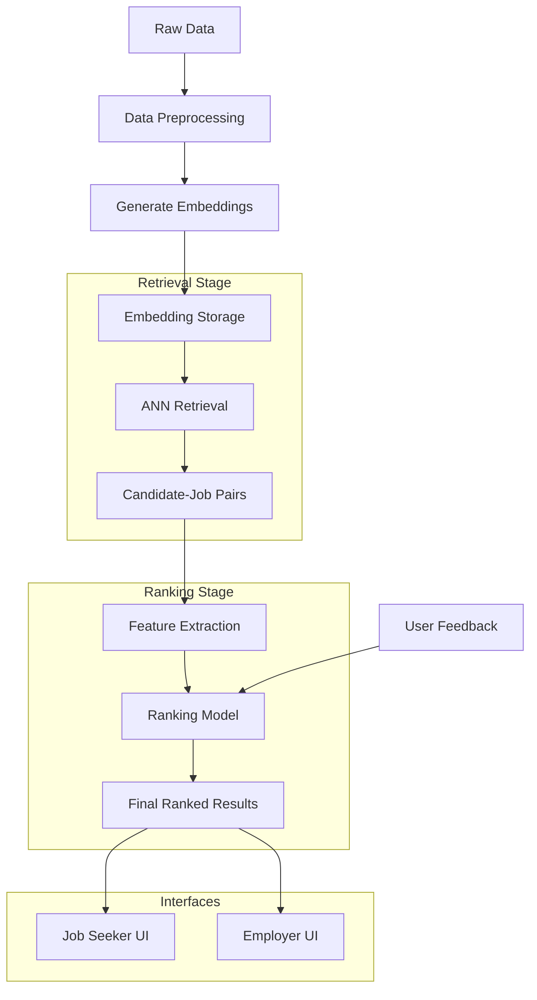

# Job Matching Recommendation System - Project Overview

## Introduction

The Job Matching Recommendation System is a complete solution for connecting job seekers with relevant roles based on skills, experience, and preferences using AI. This document provides a comprehensive overview of the system architecture, implementation details, and usage instructions.

## System Architecture

The recommendation system uses a two-stage pipeline:

1. **Retrieval Stage**: Uses Approximate Nearest Neighbors (ANN) to efficiently find potential candidate-job matches based on embedding similarity.
2. **Ranking Stage**: Scores and orders the retrieved candidate-job pairs using a more sophisticated model that considers multiple matching factors.


### Key Components

- **Data Generation Module**: Creates synthetic data for testing and development.
- **Preprocessing Pipeline**: Transforms raw data into embeddings.
- **Retrieval Model**: Implements ANN search for first-stage matching.
- **Ranking Model**: Uses advanced ML techniques for second-stage ranking.
- **Evaluation Framework**: Measures system performance with industry-standard metrics.
- **User Interfaces**: Separate UIs for job seekers and employers.

## Technical Implementation

### Data Generation & Preprocessing

We generate synthetic data that mimics real-world job seekers and job listings, including:
- Personal information (name, location, etc.)
- Skills and expertise
- Work experience
- Educational background
- Job preferences

The preprocessing pipeline converts this data into dense vector embeddings using the SentenceTransformer model, which captures semantic meaning and enables efficient similarity search.

### Retrieval Model

The retrieval model uses FAISS (Facebook AI Similarity Search) to implement efficient approximate nearest neighbor search:

- **Index Types**: Supports Flat, IVF, and HNSW indices for different performance/accuracy tradeoffs.
- **Search Strategy**: For each job, retrieves top-k candidate matches based on embedding similarity.
- **Optimization**: Configurable for speed vs. accuracy tradeoffs.

### Ranking Model

The ranking model refines the initial matches using more sophisticated features:

- **Feature Extraction**: Extracts 15+ features including skill match ratios, experience match, education match, location preferences, etc.
- **Model Types**: Supports XGBoost and linear models.
- **Training**: Uses synthetic labels generated based on feature importance (in a real system, these would come from user feedback).
- **Scoring**: Produces a final match score that represents the compatibility between a candidate and job.

### Evaluation

The evaluation framework measures system performance with industry-standard metrics:

- **Precision@k**: Measures how many of the top-k recommendations are relevant.
- **NDCG@k**: Measures the quality of ranking, considering both relevance and position.
- **Skill Coverage**: Evaluates how well the recommended candidates' skills cover job requirements.
- **Retrieval Recall**: Measures what percentage of relevant matches are captured in the retrieval stage.

## User Interfaces

### Job Seeker Interface

The job seeker UI provides:
- A dashboard with match statistics and summary information
- Job recommendations based on profile matching
- Skill recommendations to improve matching
- Application tracking and management

### Employer Interface

The employer UI provides:
- A dashboard with analytics on active jobs and applications
- Candidate recommendations with detailed match explanations
- Application management and review tools
- Skill demand analytics

## Getting Started

### Prerequisites

- Python 3.8+
- Required packages (see requirements.txt)

### Installation

1. Clone the repository
```bash
git clone https://github.com/yourusername/job-matching-system.git
cd job-matching-system
```

2. Install dependencies
```bash
pip install -r requirements.txt
```

### Running the System

You can run the entire pipeline with:

```bash
python main.py
```

Or run individual components:

```bash
# Generate synthetic data
python main.py --step generate

# Preprocess data and generate embeddings
python main.py --step preprocess

# Run retrieval model
python main.py --step retrieve

# Run ranking model
python main.py --step rank

# Evaluate system performance
python main.py --step evaluate
```

### UI Prototypes

The UI prototypes can be accessed at:

- Job Seeker UI: `ui/job_seeker/index.html`
- Employer UI: `ui/employer/index.html`

## Future Improvements

1. **Feedback Loop Integration**: Implement a human-in-the-loop system to improve model performance based on user feedback.
2. **Advanced NLP Models**: Integrate more sophisticated language models for better understanding of job descriptions and resumes.
3. **Real-time Recommendations**: Enable real-time updates as new jobs or candidates are added to the system.
4. **Explainable AI**: Enhance transparency with better explanations of why certain matches are recommended.
5. **Skill Graph**: Implement a skill graph to better understand relationships between skills and enable transfer learning.

## Conclusion

The Job Matching Recommendation System demonstrates a practical application of AI in the recruitment domain. By combining efficient retrieval methods with advanced ranking models, the system provides accurate, relevant matches between job seekers and job opportunities.

## Appendix: Mermaid Diagram Code

